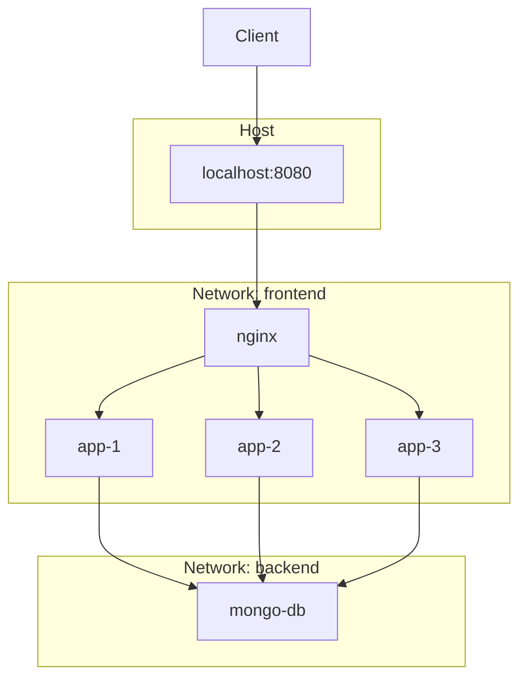

# Docker Task Manager

A small **Express + MongoDB** task API, packaged for Docker with **nginx** as a reverse proxy and load balancer in front of **three identical app instances**.

## What we built

| Component | Purpose |
|-----------|---------|
| **Express API** (`app/`) | REST API for tasks, health check, MongoDB via Mongoose |
| **MongoDB** (`mongo-db`) | Persistent task storage with root credentials from `.env` |
| **Three app replicas** (`app-1`, `app-2`, `app-3`) | Same image and config; each sets `APP_NAME` for observability |
| **nginx** | Reverse proxy, **least_conn** load balancing, upstream keepalive, passive failover |
| **Docker Compose** | Orchestrates services, **frontend** / **backend** networks, env from root `.env` |

Only **nginx** is published to the host (`8080 → 80`). App instances and MongoDB are reachable on the internal Docker networks (MongoDB is also mapped to `27017` on the host for local tools).

## High-level architecture

### Box diagram

```
┌─────────────────────────────────────────────────────────────────────────────┐
│ HOST                                                                         │
│                                                                              │
│   ┌──────────────┐         published port                                    │
│   │    Client    │ ──────► localhost:8080 ──────► ┌─────────────────────┐  │
│   │ curl/browser │                               │ nginx (load balancer)│  │
│   └──────────────┘                               │ Docker :80           │  │
│                                                  └──────────┬──────────┘  │
│  ┌──────────────────────────────────────────────────────────┼────────────┐  │
│  │ Docker network: frontend                                  │            │  │
│  │                                                           │ round robin │  │
│  │              ┌──────────────┐ ┌──────────────┐ ┌─────────▼──────────┐ │  │
│  │              │    app-1     │ │    app-2     │ │       app-3        │ │  │
│  │              │ Express :3000│ │ Express :3000│ │    Express :3000   │ │  │
│  │              │ APP_NAME set │ │ APP_NAME set │ │    APP_NAME set    │ │  │
│  │              └──────┬───────┘ └──────┬───────┘ └─────────┬──────────┘ │  │
│  └─────────────────────┼────────────────┼───────────────────┼────────────┘  │
│                        │                │                   │               │
│  ┌─────────────────────┼────────────────┼───────────────────┼────────────┐  │
│  │ Docker network: backend (apps only; nginx not attached)  │            │  │
│  │                        └────────────────┴───────────────────┘            │  │
│  │                                        │                                 │  │
│  │                               ┌────────▼────────┐                        │  │
│  │                               │    mongo-db     │                        │  │
│  │                               │ MongoDB :27017  │                        │  │
│  │                               │ volume: data    │                        │  │
│  │                               └─────────────────┘                        │  │
│  └──────────────────────────────────────────────────────────────────────────┘  │
│                                                                              │
│  Config: root `.env`  →  Compose (Mongo creds) + app containers (MONGODB_URI)│
└─────────────────────────────────────────────────────────────────────────────┘
```

### Flow (Mermaid — box view)



**Request path:** client → nginx → one of `app-1` / `app-2` / `app-3` → `mongo-db`.

**Network isolation:** nginx cannot reach MongoDB directly; only app containers join both `frontend` and `backend`.

## Project layout

```
docker-task-manager/
├── app/
│   ├── src/
│   │   ├── server.js       # Express entry, loads root .env
│   │   ├── db.js           # Mongoose models & DB helpers
│   │   └── routes/
│   │       └── tasks.js    # Task CRUD routes
│   ├── package.json
│   ├── Dockerfile
│   └── .dockerignore
├── nginx/
│   └── nginx.conf          # Upstream pool + proxy settings
├── compose.yaml            # mongo-db, app-1/2/3, nginx
├── .env.example            # Template for root .env
├── .dockerignore
└── README.md
```

Environment variables live in **`.env` at the repository root** (not under `app/`). The app loads that file at startup; Compose also uses it for `env_file` and `${VAR}` substitution.

## Prerequisites

- [Docker](https://docs.docker.com/get-docker/) and Docker Compose v2
- Copy env template: `cp .env.example .env` (Windows: copy `.env.example` to `.env`)

## Run with Docker

```bash
docker compose up --build
```

Base URL (nginx):

```text
http://localhost:8080
```

Port **8080** is used on the host so the stack does not conflict with other services often bound to port **80** (for example Apache on Windows). To use port 80 instead, change `ports` in `compose.yaml` and ensure nothing else is listening on 80.

## API

| Method | Path | Description |
|--------|------|-------------|
| `GET` | `/health` | Liveness check |
| `GET` | `/api/tasks` | List all tasks |
| `POST` | `/api/tasks` | Create task (`title` required, optional `description`) |
| `DELETE` | `/api/tasks/:id` | Delete task by MongoDB id |

### Examples

```bash
curl http://localhost:8080/health
curl http://localhost:8080/api/tasks
curl -X POST http://localhost:8080/api/tasks \
  -H "Content-Type: application/json" \
  -d "{\"title\":\"Buy milk\",\"description\":\"2%\"}"
```

## Environment variables

| Variable | Used by | Description |
|----------|---------|-------------|
| `PORT` | App | HTTP port inside container (default `3000`) |
| `MONGO_INITDB_ROOT_USERNAME` | Compose → MongoDB | Root username |
| `MONGO_INITDB_ROOT_PASSWORD` | Compose → MongoDB | Root password |
| `MONGODB_URI` | App | Connection string; host must be `mongo-db` in Docker |
| `APP_NAME` | App (set in Compose) | `app-1`, `app-2`, or `app-3` for response headers |

See `.env.example` for a working template. Keep `MONGODB_URI` credentials aligned with `MONGO_INITDB_*`.

## Load balancing and response headers

nginx distributes traffic across **app-1**, **app-2**, and **app-3** using **least_conn**, with **keepalive** connections to the upstream pool and **proxy_next_upstream** retries on errors/timeouts.

Useful response headers when debugging:

| Header | Source | Meaning |
|--------|--------|---------|
| `X-App-Name` | Express | Which replica handled the request (`app-1`, `app-2`, `app-3`) |
| `X-App-Instance` | Express | Same as `X-App-Name` |
| `X-App-Backend-Address` | nginx | Upstream socket (often container IP:3000) |
| `X-App-Backend-Status` | nginx | HTTP status from the chosen upstream |

After changing app or Compose config, rebuild containers:

```bash
docker compose up -d --build
```

## Local development (without Compose)

From the repo root, ensure `.env` exists. Install and run from `app/`:

```bash
cd app
npm install
npm run dev
```

For MongoDB on the host, set `MONGODB_URI` in root `.env` to point at your local instance (for example `localhost` instead of `mongo-db`).

## License

ISC (see `app/package.json`).
